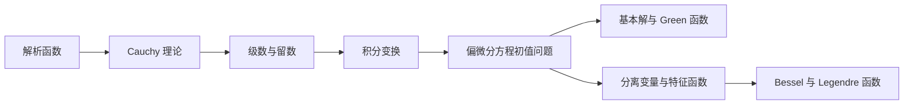

---
longform:
  format: scenes
  title: 复变函数与数理方程
  workflow: Default Workflow
  sceneFolder: /
  scenes:
    - - 复变函数
      - 复数与复变函数
      - 解析函数
      - 复积分与 Cauchy 理论
      - 复级数与 Laurent 展开
      - 留数定理
    - - 积分变换
      - Fourier 变换
      - Dirac delta 函数
      - Laplace 变换
    - - 数理方程
      - 偏微分方程的分类
      - 数理方程与定解问题
      - 特征线法
      - 热传导方程
      - 位势方程与 Green 函数
      - 分离变量法
    - - 特殊函数
      - Bessel 函数
      - Legendre 多项式
  ignoredFiles:
    - QUESTIONS
    - CONTENT
    - EXPORT
---

本课程把复分析工具、积分变换和偏微分方程求解统一到「解析结构—谱分解—基本解」三类思想中。复变函数提供围道积分与留数，积分变换把微分运算化为代数运算，数理方程与特殊函数则处理具有初边值条件的场问题。

## 知识地图

## 复变函数

+ [[复变函数]]：复数表示、解析性、积分、展开和留数的整体路线。
+ [[复数与复变函数]]与[[解析函数]]建立复可导、Cauchy–Riemann 条件和调和函数的联系。
+ [[复积分与 Cauchy 理论]]给出解析函数的整体约束，[[复级数与 Laurent 展开]]刻画局部解析结构。
+ [[留数定理]]把孤立奇点的局部系数转化为闭路积分和实积分的计算工具。

## 积分变换

+ [[积分变换]]：时域或空域微分问题转到变换域的统一框架。
+ [[Fourier 变换]]处理全轴频谱、卷积与微分性质，[[Dirac delta 函数]]描述点源和单位冲激。
+ [[Laplace 变换]]适合半轴初值问题，并可通过复反演与留数计算逆变换。

## 数理方程

+ [[数理方程]]：从模型、定解条件到三类主要求解方法的总览。
+ [[偏微分方程的分类]]区分双曲型、抛物型和椭圆型，[[数理方程与定解问题]]连接守恒律、初边值条件与适定性。
+ [[特征线法]]求解输运方程和波动方程初值问题，[[热传导方程]]体现耗散与瞬时光滑化。
+ [[位势方程与 Green 函数]]处理椭圆边值问题，[[分离变量法]]把混合问题化成特征值展开。

## 特殊函数

+ [[特殊函数]]：由坐标系与边界几何产生的特征函数总览。
+ [[Bessel 函数]]对应柱坐标径向问题，[[Legendre 多项式]]对应球坐标角向问题。

## 辅助材料

+ [[QUESTIONS|推免问答题库]]收录本课程相关口试题和参考回答。
