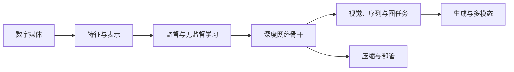

---
longform:
  format: scenes
  title: 媒体与认知
  workflow: Default Workflow
  sceneFolder: /
  scenes:
    - - 媒体与认知
      - 媒体信息与人类认知
      - 特征表示与降维
      - 局部视觉特征
    - - 统计学习
      - 线性回归与优化
      - 分类与支持向量机
      - Softmax 回归
      - 聚类与混合模型
      - 模型评估与泛化
    - - 深度学习
      - 多层感知机与反向传播
      - 卷积神经网络
      - 目标检测
      - 循环神经网络
      - 图神经网络
      - 生成模型
      - Transformer 与多模态模型
      - 模型压缩与高效推理
  ignoredFiles:
    - QUESTIONS
    - QUESTIONS - 学习与优化
    - QUESTIONS - 视觉任务
    - QUESTIONS - 序列生成与多模态
    - CONTENT
    - EXPORT
---

本课程沿「媒体信息—特征表示—学习模型—媒体任务」组织。手工特征与经典统计学习说明如何把数据变成可分辨表示，深度学习则把表示学习和任务优化合并到端到端模型中。

## 知识地图

## 媒体与认知

+ [[媒体与认知]]：媒体、人类感知和机器认知之间的总体关系。
+ [[媒体信息与人类认知]]说明媒体作为信息载体如何连接感觉、注意、知觉、学习与记忆。
+ [[特征表示与降维]]以 PCA 说明低维表示，[[局部视觉特征]]串联 Harris、SIFT 与学习型局部特征。

## 统计学习

+ [[统计学习]]：任务、损失、优化、泛化与评估的统一框架。
+ [[线性回归与优化]]从最小二乘过渡到梯度法，[[分类与支持向量机]]和[[Softmax 回归]]处理二分类与多分类。
+ [[聚类与混合模型]]比较 K-means 与 GMM，[[模型评估与泛化]]统一正则化、偏差—方差、Precision、Recall 与 AP。

## 深度学习

+ [[深度学习]]：从神经元、反向传播到不同数据结构的网络骨干。
+ [[多层感知机与反向传播]]给出训练机制，[[卷积神经网络]]、[[循环神经网络]]和[[图神经网络]]分别利用空间、序列和关系结构。
+ [[目标检测]]连接 CNN、边界框、NMS 与 mAP，[[生成模型]]比较 GAN、VAE 与扩散模型。
+ [[Transformer 与多模态模型]]讨论注意力、视觉语言对齐与开放词汇识别，[[模型压缩与高效推理]]面向边缘部署。

## 辅助材料

+ [[QUESTIONS|推免问答题库]]按学习优化、视觉任务、序列生成与多模态三组组织。
