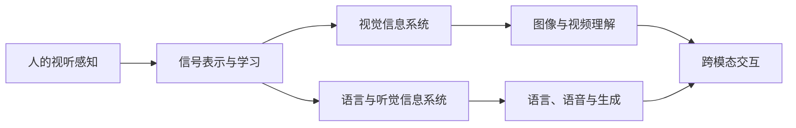

---
longform:
  format: scenes
  title: 视听信息系统导论
  workflow: Default Workflow
  sceneFolder: /
  scenes:
    - - 感知基础
      - 人的视觉系统
      - 人的听觉系统
      - 感知组织与视听交互
    - - 学习基础
      - 监督学习与线性模型
      - 神经网络与反向传播
      - 卷积网络与优化
      - PyTorch 训练流程
    - - 视觉信息系统
      - 图像表示、滤波与金字塔
      - 图像压缩编码
      - 图像特征与光流
      - 图像分类
      - 目标检测
      - 图像分割
      - Vision Transformer
      - 视频理解与自动驾驶视觉
    - - 语言与听觉信息系统
      - 统计语言模型与词向量
      - 序列模型与机器翻译
      - Transformer 与注意力
      - 预训练语言模型与大模型
      - 语音分析与识别
      - 音频生成与视听交互
  ignoredFiles:
    - CONTENT
    - EXPORT
---

本课程从人的感知机制出发，先建立信号处理与机器学习基础，再分别讨论视觉、文本、语音和视听融合系统。各章节按知识依赖组织，不对应单次授课顺序。

## 知识地图

## 感知基础

+ [[感知基础]]统一感觉器官、神经通路与信息处理的层级。
+ [[人的视觉系统]]讨论光学成像、视网膜、亮度颜色和运动感知，[[人的听觉系统]]讨论外中内耳、频率分析与声源定位。
+ [[感知组织与视听交互]]连接注意、知觉组织、场景分析与多感官融合。

## 学习基础

+ [[学习基础]]以「模型—损失—优化—评估」统摄机器学习。
+ [[监督学习与线性模型]]建立回归、分类、Softmax 与 SVM，[[神经网络与反向传播]]说明多层模型的训练机制。
+ [[卷积网络与优化]]连接 CNN、SGD 和学习率策略，[[PyTorch 训练流程]]给出可复用的工程闭环。

## 视觉信息系统

+ [[视觉信息系统]]覆盖从像素处理、压缩编码到高级视觉任务的完整链条。
+ [[图像表示、滤波与金字塔]]、[[图像压缩编码]]和[[图像特征与光流]]建立经典视觉基础。
+ [[图像分类]]、[[目标检测]]和[[图像分割]]分别处理整图、对象与像素级语义。
+ [[Vision Transformer]]说明视觉注意力骨干，[[视频理解与自动驾驶视觉]]把空间模型扩展到时间与多摄像机系统。

## 语言与听觉信息系统

+ [[语言与听觉信息系统]]统一离散符号、连续语音与跨模态生成。
+ [[统计语言模型与词向量]]从 N-gram 过渡到分布式语义，[[序列模型与机器翻译]]讨论 RNN、seq2seq 与搜索。
+ [[Transformer 与注意力]]建立并行序列表示，[[预训练语言模型与大模型]]讨论预训练、指令对齐和参数高效适配。
+ [[语音分析与识别]]组织语音表示、识别、增强和说话人任务，[[音频生成与视听交互]]连接合成、对话与音视频协同。

